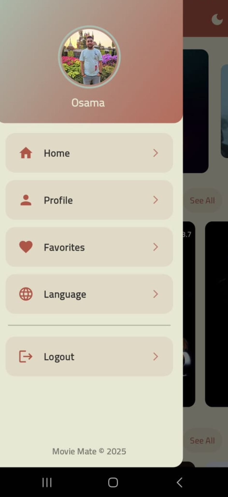

# 🎬 MovieMate - Movie Review App 🚀

MovieMate is a sleek **movie discovery & review app** powered by TMDb API.  
Search for movies, read reviews, and explore recommendations in a beautiful UI.

## 📸 Screenshots

 
  
  




## 🔥 Features

- 🎥 **Browse** trending, popular, and top-rated movies
- 📝 **Read & write reviews** with a clean UI
- ❤️ **Save favorite movies** and get personalized recommendations
- 🌙 **Dark mode & multi-language support**

## 📥 Download APK

➡️ [Download MovieMate APK (v1.0.0)](https://github.com/osama-yaseen/MovieMate/releases/latest)

## 🚀 Installation

```sh
git clone https://github.com/osama-yaseen/MovieMate.git
cd MovieMate
flutter pub get
flutter run
📌 Tech Stack
Flutter
Firebase Authentication & Firestore
TMDb API for movie data
GetX for state management
📬 Contact
📧 Email: osama.shehdeh.yaseen@gmail.com
```
